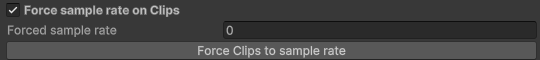
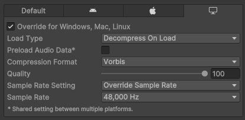

In the process of developing this package, I have come across a fairly substantial issue that I feel I should address in its own note- sample rate conversion issues/distortion.

If you don't mind a little bit of distortion on your AudioClip tracks, you can safely ignore this note. If you just want the fix, go straight to [How do we fix it?](#How%20do%20we%20fix%20it?)

---
## What is the problem?
Audio in Unity is handled pretty well in the backend, I think, but doesn't share a lot of that goodness with us developers. The AudioSource component is capable of a lot of things that we cannot do manually, such as audio streaming. One major capability that Unity hasn't opened up about is **conversion between audio sample rates**.

Sample rates become a problem very quickly when we're working with individual audio samples in Unity and playing them back, as the sample rate of an AudioClip can differ from the sample rate of Unity itself- or from another audio clip- or from procedural audio- or from platform limitations- and maybe from other things I'm not aware of. This means that as soon as we try to mix different types of audio in our components, we start to encounter issues regarding their sample rates. 

The correct way for me to fix this is to use a ratio between the Clip's sample rate and the project's sample rate, and proceed through the clip using that instead of going through one sample at a time. I have done this, and the issue was still present (though changing the progress to a double instead of a float improved it a lot- rounding errors I suppose). It's very possible that I've messed up my code for this, so if you're good at audio- please check it out and prove me stupid :)))

For example, let's take the "I'll Never Smile Again" audio in the [1. Basic Radio Sample](../../Guides/1.%20Basic%20Radio%20Sample.md) project. The sample rate of this audio as it's provided is 44100kHz- this is fine for most usages, but Unity runs at 48000kHz by default. Usually we would have no issues with this, but because we're using the individual audio samples ourselves rather than feeding them through an AudioSource, we will get some light distortion or even pitch shifts if we handle this improperly. This can be heard if you manually change the clip's sample rate override and listen closely- check out [this video I posted while trying to find fixes for this exact problem](https://youtu.be/UC8RpxZMkz4) to see what could happen.

## How do we fix it?
If it's not something you can or are willing to ignore, the main option for fixing this problem is setting a global sample rate, and forcing your clips to it.

### Setting a global sample rate
We need to do this at the moment so that we know what sample rate to assign to the clips. Unity, by default, uses the sample rate of the system running the game build, but because we'd be needing to re-export our audio files every time the project is built in order to fix this, it's much easier to assign a single sample rate to use globally.

**Please keep in mind that this change will apply to your entire project. Unity seems to resample audio files used in AudioSources on its own, so you may not notice any effects- but it's worth keeping in mind that this process is happening.**

To change the global sample rate, go to `Edit >> Project Settings >> Audio` then change the `System Sample Rate` option. Generally you want to use 48000 for Windows devices, and 44100 for Mac. You may need to look up the base audio sample rate for other platforms.

Next, we need to apply this sample rate to our clips.
### Forcing sample rates on clips
There're two ways of doing this. I recommend the Integrated way first for easier implementation, then doing the Manual way afterwards if you want to be absolutely sure that it worked.
#### Integrated way
The Integrated way is built-in to RadioData objects. Opening the Advanced Settings tab will show the following:

Make sure **Force sample rate on Clips** is ticked. It's generally a good idea to provide the specific sample rate you've just assigned in Project Settings, though when the forced sample rate is set to 0, it will attempt to match the sample rate of the project- for some reason, this is normally stuck at 0.
Press the button to assign the sample rate on all AudioClips referenced in the RadioData!

Please note two things about this method:
1. This affects ALL the AudioClips referenced, even those in Stations- there is no way to exclude clips from this except for removing them from the radio temporarily. Please make sure that you're okay with this change being applied to every applicable clip.
2. The default sample rate matches the current build target. If you're [having distortion on certain platforms](\(Predicted)%20Common%20Issues%20and%20Questions.md#My%20track%20has%20distortion%20in%20a%20build%20for%20a%20specific%20platform!|having%20distortion%20on%20specific%20platforms), my recommendation is to hit the Force button again after the platform has been targeted in Build Settings. If this does not help, [contact me](../Contact.md) :)

#### Manual way
The manual way requires you to trawl individually through applicable audio clips and override the sample rate yourself. This is substantially slower, but a lot safer than universally overriding sample rates.

To do this, select an AudioClip in the inspector. Select the target platform, select the Override toggle. Select `Override Sample Rate` on Sample Rate Setting, then select a sample rate below. 

Do note that this has to be done for each applicable clip for each applicable platform.