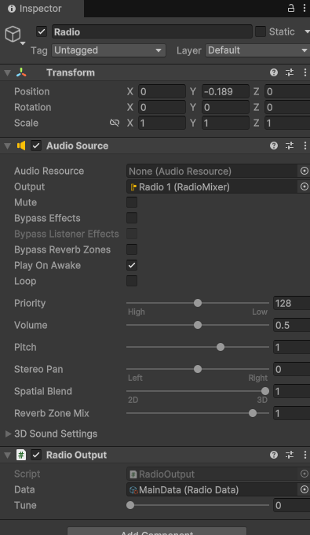
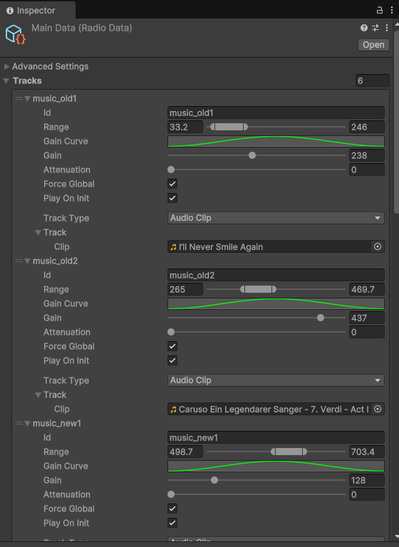
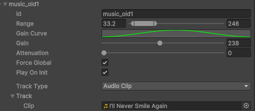
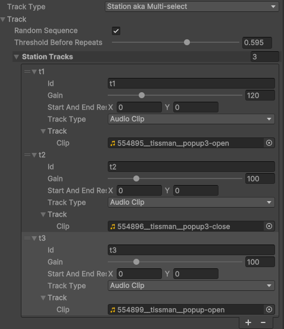
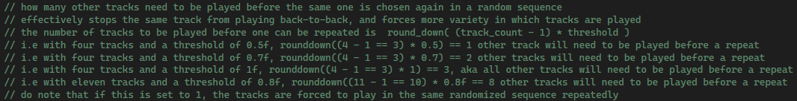
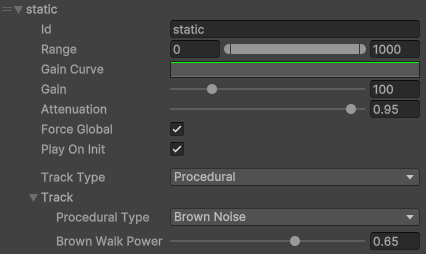

This sample is a basic demo intended to illustrate how a radio could be laid out, using all three default track types. Reading this entire guide isn't necessary if you'd rather check out the scene then cross-reference things you don't understand rather than taking in the whole thing- however this guide does introduce some key points about [all](#An%20average%20Track) or [specific](#Specific%20tracks) tracks.

---
## Accessing the sample
First, install the sample through Unity's Package Manager. Navigate to `RyleRadio/Samples/BasicRadio`, and open `MainScene`. It should look like this: 

## Description
### Scene
The scene is very simple, just containing some scene objects, some UI, and an object named Radio, which itself only has a RadioOutput (and its required AudioSource). 
The RadioOutput is the component that plays audio from the radio we set up. We need one in any scene where we want to play sound from our radio.

Double click on the link to MainData at the bottom- this will take you to the most important part of the radio- the RadioData object :)

This is our example of a RadioData. A RadioData is where the content played by any Output for this radio is defined- basically where you tell the radio what it is and how it works. When I refer to a "radio" as an object in the rest of this guide, I'm usually referring to this RadioData object.
To create a new RadioData in your own project, right click in files, then `Ryle Radio > Radio Data`.
A RadioData contains two parts- the advanced settings and the list of Tracks- the latter of which we should talk about in a couple of its own sections, as it's pretty much the only reason we have a RadioData object to begin with.
### An average Track
The tracks in a RadioData are the different sets of audio it will play during runtime, depending on what tune you've provided to it. Tracks come in different types, but each contain some common values. Let's have a closer look at what a track contains :)

#### ID
The ID of a Track is an identifier used whenever you're choosing a specific track for something. For example, if you want to set up an object to broadcast a track in a specific area, you need to somehow choose which track to broadcast, right? The ID is how you tell the difference between tracks.
There's no set naming convention for tracks- I've used a really simple one here to show that this track plays music, old music, and is the first one that does so. You can set it up however you want, but I would generally recommend using something unique for each track unless you know what you're working with.
#### Range
The Range of a track is the domain of tunes where the track is playing. That is, if an Output has its tune within the range listed in this track, it will play the track. Range is by default locked between 0 and 1000, but this is (kind of) flexible. You can adjust a const value in RadioData to adjust it.
In this case, our track can only be heard when the user is at a tune between 33.2 and 246. Any Output with a tune value in this range will be able to hear it.

This is, however, heavily influenced by the Range Curve.
#### Range Curve
The range curve controls how high the volume on the track is when it's within the defined Range. If the curve is flat, a song will have the same volume at any tune within its range- but a bell curve would taper off the more distant the tune. Check out [What does the Gain curve do?](General/Info/%5C(Predicted)%20Common%20Issues%20and%20Questions#What%20does%20the%20Gain%20curve%20do) for a better explanation!
In this example, the range curve is a hill shape- it means that the volume of the track will smoothly rise and fall depending on where in the range an Output's tune value is. This sounds consistent and balanced when changing tune over time.
#### Gain
The gain slider controls how loud the track is. The higher the gain, the louder the track. Simple!
To be more technical, the gain is the first thing applied to the track when calculating its output volume. If you want to change the loudness of a track without modifying the track itself, this is your first target.
The gain on this particular track is fairly high- this is because the track, by default, is pretty quiet.
#### Attenuation
To explain attenuation, we need to introduce **Track priority**. Track priority is extremely simple- it's the order of the tracks in the RadioData. The track at the top of the list is highest priority, the track at the bottom is lowest. Giving it a separate name probably talks it up too much lol
Attenuation makes a track lower in volume when a higher priority track is playing. This is especially useful for background tracks or static, making them quieter when a song or other track starts playing over the top. The higher the attenuation value, the quieter the track gets.
On this particular track, the attenuation is set to 0. The track is the highest priority in the radio as well, so turning up attenuation would do nothing.

*Note: If anyone needs more complex attenuation layering, [let me know](General/Contact.md)! I've been debating adding attenuation layers(???), but I'm not sure if they're worth the effort if they'd never be used lol. For the moment, direct order priority works well :)*
#### Force global
For the moment, keep this ticked. This setting is explained further in [2. Spatial Components Sample](2.%20Spatial%20Components%20Sample).
#### Play on Init
Whether or not the track will start playing as soon as the game starts. More often than not, you'll be leaving this ticked- as we do on this particular example. To see a time we don't leave it ticked, check [3. Interaction Components Sample](3.%20Interaction%20Components%20Sample).
#### Track Type
This is where you select the content of the tracks. We'll have a closer look at this in a moment :)

### Specific tracks
Let's first look at what **Track types** are, and what they mean.

The track type defines the content of a particular track. When clicked on, you will see a dropdown listing a few different options:
- A track set to **Audio Clip** will allow you to specify an audio file that it will play. This is the most common choice.
- A track set to **Procedural** will allow you to generate new audio at runtime, such as static noise or a single tone. Useful for adding depth and complexity to a radio.
- A track set to **Station aka Multi-select** contains more tracks, and switches between them over time.
On this sample radio, there's at least one track of each type. Let's go over them!
#### music_old1 / music_old2 / music_new1 / music_new2

These are singular songs that play on the radio- they're the primary track that should be playing over everything else- the important audio, if you will.
- Their **IDs** provide some identification as to what each type of audio each track plays, and how "old" the tracks sound (sorry guys).
- Their **Ranges** are all different, and non-overlapping- this means that when tuning along the radio, they can all be heard at different times.
- Their **Range curves** are all the same- smoothly fading the volume of each track in and out depending on the Output's tune.
- Their **Gain** values all depend on the specific track- some clips are quieter than others, so we give them a higher gain.
- Their **Attenuations** are all 0- they are the highest-priority audio, and every other track should be getting quieter when it plays- not the other way around. Therefore, we keep attenuation at 0.
- **Force global** is always true for this sample.
- **Play on Init** is also always true- we want this radio to play from the game's start.
- Their **Track types** are all **Audio Clip**. This means that every track uses a specific AudioClip that contains a different song. We can easily change which song each track plays just like a normal Unity AudioSource- try it yourself!
	- *Note the [sample rates](../General/Info/Sample%20Rates-%20an%20important%20note.md) of the clips*
#### station_sfx

This is an example of a **Station**- a track that contains other tracks. In this case, we have a station that plays a few different SFX clips and switches between them every time one finishes. We'll have a closer look at how to use Stations!
- The **Random Sequence** setting on a station defines whether it plays each child track in order, or if it uses a random order. In this case, we want the SFX to play in a random order, switching between each, so we tick this setting.
- The **Threshold Before Repeats** setting is a little more complex. It controls how many other tracks need to be played before one track can be played again. I believe the code comments explain it best :)  In this situation, we don't want to play the same SFX more than once in a row. We therefore use a threshold above 0.5 to show that we want 1 ((3 - 1 == 2) * 0.5) == 1 other station track to play before the same one can play again.
- Then finally, we have our **Station Tracks**. These are almost identical to the Tracks we create in RadioData themselves, with some slight differences.
	- They don't have ranges, gain curves, attenuations or playing controls- these are all defined by the station itself, and are therefore unnecessary here- all station tracks use the same values.
	- They have the variable **Start and End Rests**- this is the amount of time before or after the track plays where there is silence. This is useful if you have various tracks in this station with no silence at the beginning or end, and want to separate the track switches a little. In this case, we want each SFX clip to play immediately after one another, so we set the rests to 0.
	- Finally, there's no option to make a Station in a Station. This is an artificial limitation I have put in place to help keep the package simple, but if you would like it changed, [contact me](../General/Contact.md)!

#### static

This is a background track that plays some white noise that resembles radio static. It's set up specifically to be a background track as follows.
- Its **Range** covers the entire line, meaning this track can be heard with any tune value.
- Its **Range curve** is flat, meaning that it use the same gain everywhere it can be heard- in this case, it's the same gain everywhere.
- Its **Attenuation** is very high. Because this track is at the bottom of the list, it has low priority. This plus the high attenuation means that if any other track is playing at the same time, this one will get quieter. This creates the effect of static "filling in the gaps" between other tracks- just like a real radio!
- Its **Track type** is set to procedural. This option allows generation of audio at runtime- in this case, we're generating a type of noise called brown noise. Other options include white noise, pink noise, sine waveforms, and so on. *Note: the Brown Walk Power variable affects the sound of the brown noise- different types of procedural audio will have different variables, so you can play around with all of them :)*

### Back to the scene
Finally, in the scene we have a very basic controller that tunes the radio in Play mode using the Q and E keys. The script for this is in the sample files, and simply modifies the RadioOutput's tune value. You can also do this in the inspector, and during Play mode.

As you can see, then, the vast majority of logic and customisation for this radio takes place in the RadioData object rather than the scene. All that the scene components do is play an Output linked to this radio (for now... check out the [next tutorial](2.%20Spatial%20Components%20Sample.md) for more).

---
## Guide over :)
That finishes the guide to this sample scene! It's been a while since I wrote a single document this long lol

I really hope this has helped you understand what's going on in this sample- if you have any more questions about concepts or objects in this guide, first check out [(Predicted) Common Issues and Questions](Predicted)%20Common%20Issues%20and%20Questions)%20Common%20Issues%20and%20Questions.md)- if that doesn't help,[contact me](../General/Contact.md) and I'll hopefully be able to lend a hand.

Next up is the [2. Spatial Components Sample](2.%20Spatial%20Components%20Sample.md) :)